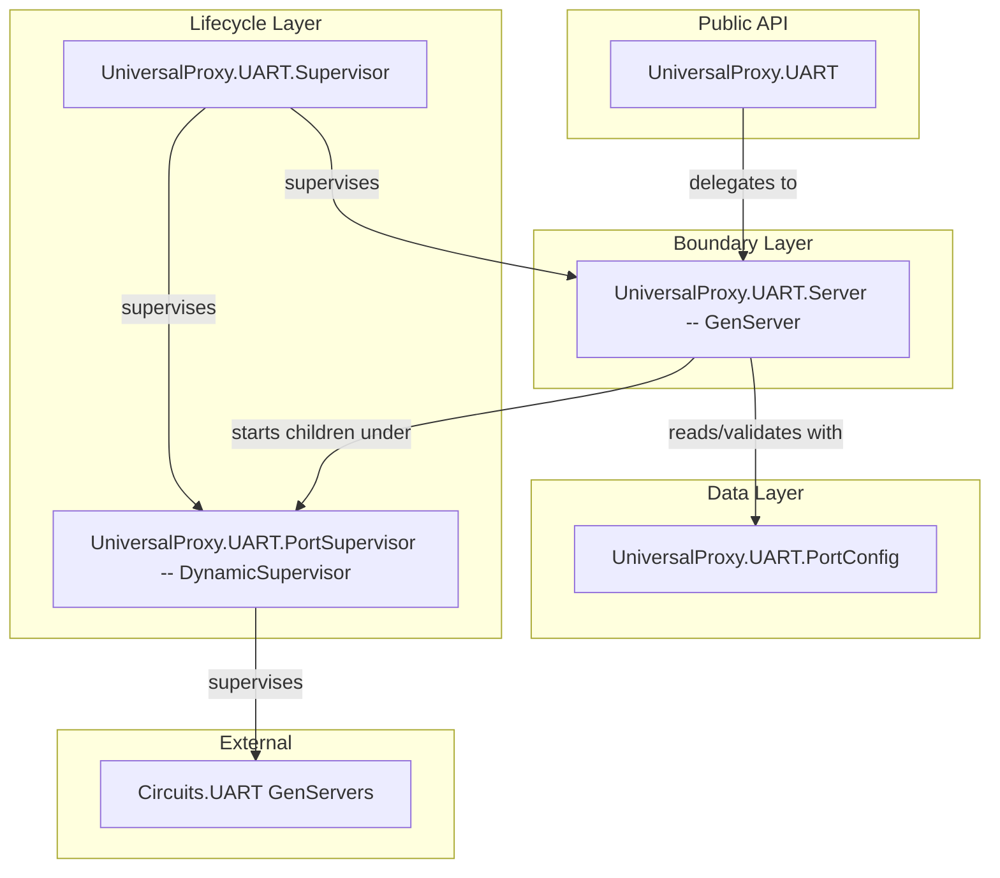

# UART Library Component

## Overview

Create a layered UART library component following the "Designing Elixir Systems with OTP" approach: Data structs, functional core, GenServer boundary, and supervision lifecycle. The component wraps Circuits.UART, manages multiple ports via a DynamicSupervisor, and exposes a clean public API.

## Architecture

Following the "Designing Elixir Systems with OTP" layered design (Data -> Functions -> Boundaries -> Lifecycle):



## Supervision Tree Integration

The UART supervisor plugs into the existing application tree in `lib/universal_proxy/application.ex`:

```
UniversalProxy.Supervisor (existing, :one_for_one)
├── UniversalProxyWeb.Telemetry
├── Phoenix.PubSub
├── UniversalProxyWeb.Endpoint
└── UniversalProxy.UART.Supervisor (:rest_for_one)
    ├── UniversalProxy.UART.PortSupervisor (DynamicSupervisor)
    └── UniversalProxy.UART.Server (GenServer)
```

`:rest_for_one` strategy ensures that if the DynamicSupervisor crashes, the Server (which tracks references to those children) also restarts. The DynamicSupervisor starts first so it is available when the Server initializes.

## Files to Create / Modify

### 1. Data Layer: `lib/universal_proxy/uart/port_config.ex`

`UniversalProxy.UART.PortConfig` -- a struct representing a port's identity and all `Circuits.UART.uart_option()` settings. Includes:

- `name` (the device path, e.g. `"/dev/ttyUSB0"`)
- All `uart_option()` fields: `speed`, `data_bits`, `stop_bits`, `parity`, `flow_control`, `framing`, `rx_framing_timeout`, `active`, `id`, and the RS485 options
- A `new/2` function that builds a `%PortConfig{}` from a port name and keyword opts, applying defaults (speed: 9600, data_bits: 8, stop_bits: 1, parity: :none, flow_control: :none, active: true)
- A `to_uart_opts/1` function that converts the struct back to the keyword list that `Circuits.UART.open/3` expects (stripping nil values)

### 2. Boundary Layer: `lib/universal_proxy/uart/server.ex`

`UniversalProxy.UART.Server` -- a GenServer that:

- Holds state: a map of `%{port_name => %{pid: pid, config: %PortConfig{}, monitor_ref: ref}}`
- `open_port/2` -- starts a `Circuits.UART` GenServer under the DynamicSupervisor, calls `Circuits.UART.open/3`, monitors the pid, stores the entry. Returns `{:ok, pid}` or `{:error, reason}`
- `close_port/1` -- calls `Circuits.UART.close/1` then `Circuits.UART.stop/1`, removes the entry, terminates the child under DynamicSupervisor
- `list_ports/0` -- returns a list of `{name, %PortConfig{}}` tuples for all tracked ports
- `port_info/1` -- returns `{:ok, %PortConfig{}}` or `{:error, :not_found}` for a specific port
- Handles `:DOWN` messages for monitored Circuits.UART pids (cleanup on crash)

### 3. Lifecycle Layer: `lib/universal_proxy/uart/supervisor.ex`

`UniversalProxy.UART.Supervisor` -- a Supervisor with `:rest_for_one` strategy starting:

1. `{DynamicSupervisor, name: UniversalProxy.UART.PortSupervisor, strategy: :one_for_one}`
2. `UniversalProxy.UART.Server`

### 4. Public API: `lib/universal_proxy/uart.ex`

`UniversalProxy.UART` -- the public-facing module. Thin delegation layer:

- `open(port_name, opts \\ [])` -- opens a port with the given uart_option() settings
- `close(port_name)` -- closes an opened port
- `ports()` -- returns all currently opened ports and their configs
- `port_info(port_name)` -- returns config for a specific opened port
- `enumerate()` -- delegates to `Circuits.UART.enumerate()` for device discovery

### 5. Application Integration: modify `lib/universal_proxy/application.ex`

Add `UniversalProxy.UART.Supervisor` to the `children` list.

## Key Design Decisions

- **One Circuits.UART GenServer per port**: This is how Circuits.UART works (each GenServer can only `open/3` one port). The DynamicSupervisor manages their lifecycles.
- **Server monitors UART pids**: If a Circuits.UART GenServer crashes, the Server's `:DOWN` handler cleans up the registry so stale entries don't accumulate.
- **PortConfig as a data struct**: Separates data validation/defaults from process logic. Pure functions are easy to test independently.
- **Public API is a thin wrapper**: `UniversalProxy.UART` is the boundary that callers interact with. It hides the GenServer call mechanics behind a clean interface.
