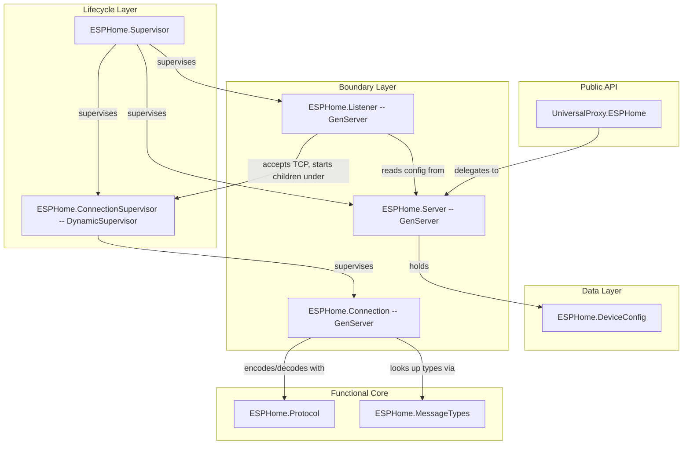

# ESPHome Native API Server Component

## Overview

Build a layered ESPHome Native API server component that listens on TCP port 6053, speaks the plaintext protocol, and identifies this device as an ESPHome device using the protobuf messages already generated in api.pb.ex. Follows the same Data -> Functions -> Boundaries -> Lifecycle architecture as the UART component.

## Architecture

Following the same layered OTP design as the UART component:



## Supervision Tree

```
UniversalProxy.Supervisor (existing)
└── UniversalProxy.ESPHome.Supervisor (:rest_for_one)
    ├── UniversalProxy.ESPHome.Server (GenServer -- config + connection tracking)
    ├── UniversalProxy.ESPHome.ConnectionSupervisor (DynamicSupervisor)
    └── UniversalProxy.ESPHome.Listener (GenServer -- TCP accept loop)
```

`:rest_for_one` ensures: if Server crashes, ConnectionSupervisor and Listener also restart. If ConnectionSupervisor crashes, Listener restarts. Listener is last because it depends on both.

## Protocol Details (Plaintext)

Per the [ESPHome protocol docs](https://developers.esphome.io/architecture/api/protocol_details/) and comments in `priv/protos/api.proto`, each plaintext frame is:

- `0x00` indicator byte
- VarInt: payload size (protobuf data only, excludes type)
- VarInt: message type ID
- Protobuf-encoded payload bytes

The state machine is simple: `INITIALIZE -> DATA` (no handshake). In DATA state, respond to messages from clients.

## Key Message Type IDs (from api.proto)

These are the messages needed for the initial device identification flow:

- 1: `HelloRequest` (client -> server)
- 2: `HelloResponse` (server -> client)
- 5: `DisconnectRequest` (bidirectional)
- 6: `DisconnectResponse` (bidirectional)
- 7: `PingRequest`
- 8: `PingResponse`
- 9: `DeviceInfoRequest` (client -> server)
- 10: `DeviceInfoResponse` (server -> client)
- 11: `ListEntitiesRequest`
- 19: `ListEntitiesDoneResponse`
- 20: `SubscribeStatesRequest`

All protobuf modules already exist in `lib/api.pb.ex` under the `UniversalProxy.Protos` namespace.

## Files to Create

### 1. Data Layer: `lib/universal_proxy/esphome/device_config.ex`

`UniversalProxy.ESPHome.DeviceConfig` struct holding the device identity fields that get reported in `DeviceInfoResponse`:

- `name`, `friendly_name`, `mac_address`, `esphome_version`, `compilation_time`, `model`, `manufacturer`, `suggested_area`, `project_name`, `project_version`
- `port` (TCP listen port, default 6053)
- `new/1` builds from keyword opts with defaults
- `to_device_info_response/1` converts to a `DeviceInfoResponse` protobuf struct

### 2. Functional Core: `lib/universal_proxy/esphome/protocol.ex`

`UniversalProxy.ESPHome.Protocol` -- pure functions for the plaintext wire protocol:

- `encode_varint/1` / `decode_varint/1` -- VarInt encoding per protobuf spec
- `encode_frame/2` -- takes message_type_id + protobuf binary, returns the full frame (`<<0x00, size_varint, type_varint, payload>>`)
- `decode_frame/1` -- parses a binary into `{message_type_id, payload_binary, rest}` or `{:incomplete, binary}` for buffered TCP reads

### 3. Functional Core: `lib/universal_proxy/esphome/message_types.ex`

`UniversalProxy.ESPHome.MessageTypes` -- maps message type IDs to protobuf modules:

- `module_for_id/1` -- returns the protobuf module for a given message type ID (e.g., `1 -> UniversalProxy.Protos.HelloRequest`)
- `id_for_module/1` -- reverse lookup
- `decode_message/2` -- given `{type_id, payload_binary}`, decodes to the appropriate protobuf struct

### 4. Boundary: `lib/universal_proxy/esphome/connection.ex`

`UniversalProxy.ESPHome.Connection` -- GenServer managing a single TCP client connection:

- State: socket, buffer (for partial reads), device_config
- Uses `{:active, :once}` on the socket for back-pressure-aware reading
- `handle_info({:tcp, socket, data}, state)` -- appends to buffer, attempts frame decode, dispatches
- Message dispatch:
  - `HelloRequest` -> send `HelloResponse` (api_version_major=1, api_version_minor=10, server_info, name from config)
  - `PingRequest` -> send `PingResponse`
  - `DeviceInfoRequest` -> send `DeviceInfoResponse` built from DeviceConfig
  - `ListEntitiesRequest` -> send `ListEntitiesDoneResponse` (empty entity list for now)
  - `SubscribeStatesRequest` -> no-op acknowledge (no entities yet)
  - `DisconnectRequest` -> send `DisconnectResponse`, close socket
- `handle_info({:tcp_closed, _}, state)` -- cleanup

### 5. Boundary: `lib/universal_proxy/esphome/listener.ex`

`UniversalProxy.ESPHome.Listener` -- GenServer that:

- Opens a `:gen_tcp.listen/2` socket on init (port from Server config)
- Spawns a linked acceptor process that loops on `:gen_tcp.accept/1`
- On new connections: starts a `Connection` under the `ConnectionSupervisor`, transfers socket ownership

### 6. Boundary: `lib/universal_proxy/esphome/server.ex`

`UniversalProxy.ESPHome.Server` -- GenServer that:

- Holds the `%DeviceConfig{}` in state (configurable at runtime)
- Provides `get_config/0`, `update_config/1` calls
- Tracks active connections (count, pids) via monitors

### 7. Lifecycle: `lib/universal_proxy/esphome/supervisor.ex`

`UniversalProxy.ESPHome.Supervisor` -- Supervisor with `:rest_for_one` starting:

1. `UniversalProxy.ESPHome.Server`
2. `{DynamicSupervisor, name: UniversalProxy.ESPHome.ConnectionSupervisor}`
3. `UniversalProxy.ESPHome.Listener`

### 8. Public API: `lib/universal_proxy/esphome.ex`

`UniversalProxy.ESPHome` -- thin boundary module:

- `config/0` -- returns the current DeviceConfig
- `update_config/1` -- updates identity at runtime
- `connections/0` -- lists active client connections
- `port/0` -- returns the listening port

### 9. Modify: `lib/universal_proxy/application.ex`

Add `UniversalProxy.ESPHome.Supervisor` to the children list, after the UART supervisor.
