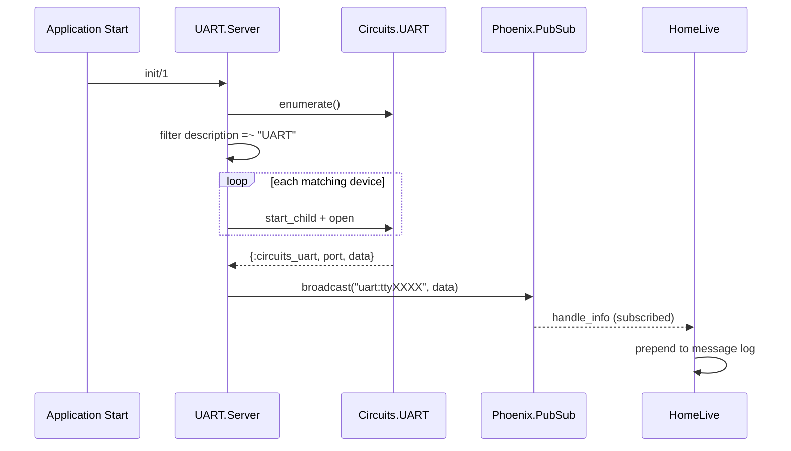

# UART Auto-Open with PubSub and Home Page Live Feed

## Overview

Auto-open UART devices whose description contains "UART" on startup, assign each a friendly name (tty + serial number), publish received data to PubSub topics, and build a Home page with opened UARTs table and live message feed.

## Architecture

## Changes

### 1. Add `friendly_name` to PortConfig

**File**: `lib/universal_proxy/uart/port_config.ex`

- Add `friendly_name: nil` field to the struct and typespec
- This stores the `"tty<serial_number>"` label assigned at open time

### 2. Update UART.Server for auto-open and PubSub

**File**: `lib/universal_proxy/uart/server.ex`

- **Auto-open in `init/1`**: After initializing state, call a private `auto_open_devices/0` function that:
  - Calls `Circuits.UART.enumerate/0`
  - Filters devices where `info[:description]` contains "UART" (case-insensitive) AND `info[:serial_number]` is present
  - For each match, opens the port with defaults and assigns `friendly_name: "tty#{serial_number}"`
  - Logs each opened port at info level
  - Devices without a serial number are skipped (no way to build a stable name)
- **Handle incoming UART data**: Add a `handle_info/2` clause for `{:circuits_uart, port_name, data}` that:
  - Looks up the port's `friendly_name` from state
  - Broadcasts to PubSub topic `"uart:<friendly_name>"` with payload `%{name: friendly_name, data: data, timestamp: DateTime.utc_now()}`
  - The existing catch-all `handle_info(_msg, state)` must come AFTER this clause
- **Track friendly_name in open_port**: When opening via the API (`open_port/2`), if opts include `:friendly_name`, store it; otherwise default to `nil`
- **Add `list_ports_with_names/0`**: New client function returning `[%{path: ..., friendly_name: ..., config: ...}]` for the Home page

### 3. Extend public API

**File**: `lib/universal_proxy/uart.ex`

- Add `open/3` variant that accepts a friendly_name
- Add `named_ports/0` that returns the list of opened ports with their friendly names (delegates to Server)

### 4. Build the Home page LiveView

**File**: `lib/universal_proxy_web/live/home_live.ex`

- **mount/3**:
  - Load opened ports via `UniversalProxy.UART.named_ports()`
  - Subscribe to PubSub topic `"uart:<name>"` for each opened port
  - Initialize `@messages` as an empty list, `@ports` as the port list
  - Also subscribe to a `"uart:port_opened"` topic so if new ports open after mount, the LiveView can subscribe to those too
- **handle_info for PubSub messages**:
  - Prepend incoming message to `@messages`, cap at 100 entries
  - Update socket assigns
- **render/1** -- two sections:
  - **Opened UARTs table**: Columns for friendly name, device path, speed. Uses the same cyberpunk table styling as Connected Devices page.
  - **Live Message Feed**: A scrolling container showing messages with columns: timestamp, source name, data (hex-encoded or raw depending on content). Most recent at top. Empty state shows "No messages received yet."

### 5. PubSub topic convention

- Per-device topic: `"uart:<friendly_name>"` (e.g., `"uart:tty1234ABCD"`)
- Port lifecycle topic: `"uart:port_opened"` and `"uart:port_closed"` for dynamic updates

## File summary

| File                                        | Change                                                |
| ------------------------------------------- | ----------------------------------------------------- |
| `lib/universal_proxy/uart/port_config.ex`   | Add `friendly_name` field                             |
| `lib/universal_proxy/uart/server.ex`        | Auto-open in init, handle UART data, PubSub broadcast |
| `lib/universal_proxy/uart.ex`               | Add `named_ports/0` API                               |
| `lib/universal_proxy_web/live/home_live.ex` | Two-section UI with ports table + live message feed   |
