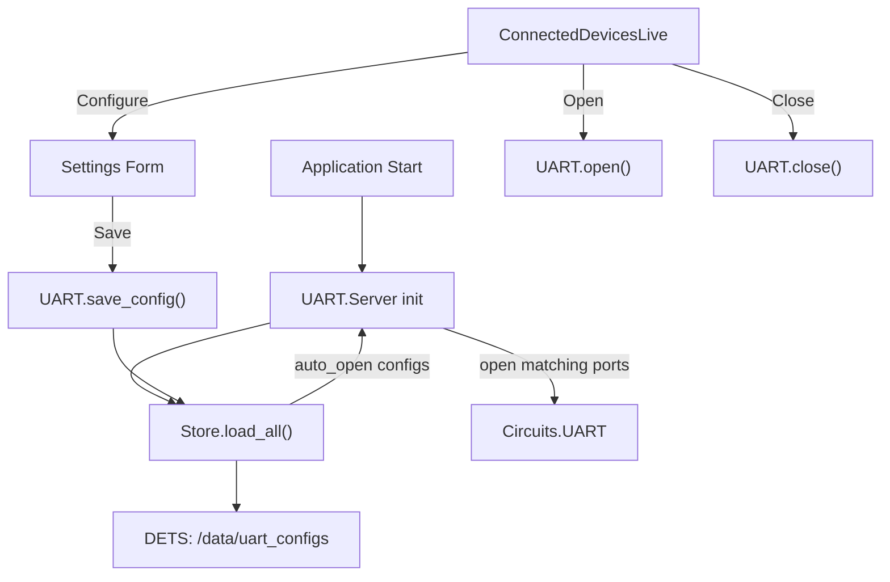

# UART Saved Configuration and Connected Devices UI

## Overview

Replace the unconditional auto-open with a DETS-backed device configuration store. The Connected Devices page gains per-device Configure/Open/Close buttons and a settings form. On boot, only previously-configured devices marked as auto-open are opened with their saved settings.

## Architecture

## New file: UART.Store (DETS persistence)

**File**: `lib/universal_proxy/uart/store.ex`

A simple GenServer wrapping a DETS table that stores device configs keyed by serial number. Each entry is a map with:

- `:serial_number` -- the key (from hardware enumeration)
- `:friendly_name` -- auto-generated as `"tty#{serial_number}"`
- `:speed` -- baudrate
- `:data_bits` -- 5..8
- `:stop_bits` -- 1..2
- `:parity` -- atom
- `:flow_control` -- atom
- `:auto_open` -- boolean

The DETS file lives at `/data/uart_configs.dets` on Nerves (writable partition) and `_build/uart_configs.dets` on host for dev. The Store provides:

- `save_config(serial_number, params_map)` -- insert/update
- `delete_config(serial_number)` -- remove
- `get_config(serial_number)` -- lookup
- `all_configs()` -- list all saved configs
- `auto_open_configs()` -- list only those with `auto_open: true`

## Changes to UART.Server

**File**: `lib/universal_proxy/uart/server.ex`

- **Replace `auto_open_devices/1`**: Instead of filtering by description, call `Store.auto_open_configs()`, match each config's serial number against `Circuits.UART.enumerate()` results to find the current device path, then open with the saved settings.
- Keep all existing PubSub broadcasting and `named_ports` logic unchanged.

## Changes to UART.Supervisor

**File**: `lib/universal_proxy/uart/supervisor.ex`

- Add `UniversalProxy.UART.Store` as a child **before** `UniversalProxy.UART.Server` so the DETS table is ready when the Server reads auto-open configs.

## Changes to UART public API

**File**: `lib/universal_proxy/uart.ex`

- Add `save_config/2` -- delegates to Store
- Add `delete_config/1` -- delegates to Store
- Add `get_config/1` -- delegates to Store
- Add `saved_configs/0` -- delegates to Store

## Connected Devices LiveView overhaul

**File**: `lib/universal_proxy_web/live/connected_devices_live.ex`

The page merges two data sources: hardware-enumerated devices and saved configs. Each row shows:

- Device path, description, serial number (from enumeration)
- Status indicator: **Open** (green), **Configured** (yellow), or **Unconfigured** (gray)
- Action buttons based on state:
  - **Unconfigured**: "Configure" button opens an inline form
  - **Configured but closed**: "Open" button, "Edit" button, "Delete Config" button
  - **Open**: "Close" button, "Edit" button

The **Configure/Edit form** (inline or modal) has fields for:

- Speed (dropdown: 9600, 19200, 38400, 57600, 115200, 230400, 460800, 921600)
- Data bits (dropdown: 5, 6, 7, 8)
- Stop bits (dropdown: 1, 2)
- Parity (dropdown: none, even, odd)
- Flow control (dropdown: none, hardware, software)
- Auto-open on boot (checkbox)

Buttons: "Cancel" and "Save". Saving calls `UART.save_config/2` and optionally opens the port immediately.

LiveView assigns:

- `@devices` -- merged list of enumerated + saved config + open status
- `@editing` -- serial number of device being edited, or nil
- `@form_data` -- current form field values

Events: `"configure"`, `"edit"`, `"cancel"`, `"save"`, `"open"`, `"close"`, `"delete_config"`

Subscribe to `"uart:port_opened"` and `"uart:port_closed"` PubSub topics to refresh state reactively.

## Files summary

- **New**: `lib/universal_proxy/uart/store.ex` -- DETS-backed config persistence
- **Edit**: `lib/universal_proxy/uart/supervisor.ex` -- add Store child
- **Edit**: `lib/universal_proxy/uart/server.ex` -- use Store for auto-open instead of description filter
- **Edit**: `lib/universal_proxy/uart.ex` -- add save/delete/get config API
- **Edit**: `lib/universal_proxy_web/live/connected_devices_live.ex` -- full UI with configure/open/close actions
