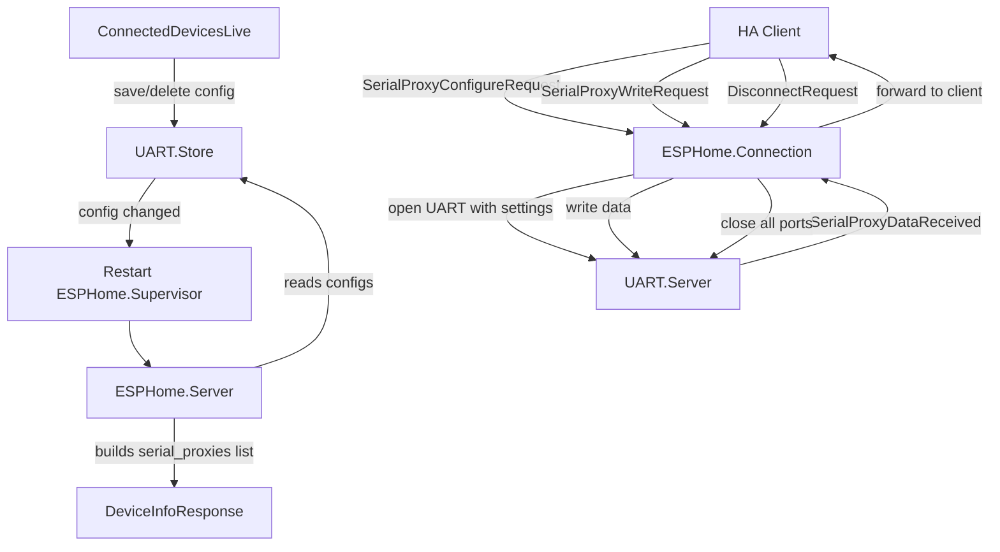

# Serial Proxy Integration

## Overview

Restructure UART ports to be opened/closed exclusively via ESPHome serial proxy protocol commands. Connected Devices UI simplifies to only setting port type. Configured devices are advertised in DeviceInfoResponse and trigger ESPHome supervisor restart on config changes.

## Summary

Ports are no longer auto-opened or manually opened from the UI. Instead:

1. Connected Devices UI only assigns a `SerialProxyPortType` to a device (by serial number)
2. Configured devices are advertised as `serial_proxies` in the ESPHome `DeviceInfoResponse`
3. ESPHome clients (Home Assistant) open/close/configure ports via serial proxy protocol messages
4. Config changes restart the ESPHome supervisor to force client reconnects (so they re-read device info)

## Architecture

## Changes by file

### 1. Simplify UART.Store -- remove serial settings, keep only port_type

**File**: `lib/universal_proxy/uart/store.ex`

- `normalize_config/1`: Remove `speed`, `data_bits`, `stop_bits`, `parity`, `flow_control`, `auto_open`. Keep only `port_type` (atom: `:ttl`, `:rs232`, `:rs485`).
- Remove `auto_open_configs/0` -- no longer needed.
- After `save_config` and `delete_config`, call `UniversalProxy.ESPHome.restart()` to force reconnects.

### 2. Simplify UART.Server -- remove auto-open, keep open/close/write for protocol use

**File**: `lib/universal_proxy/uart/server.ex`

- Remove `auto_open_devices/1` and the `:auto_open_devices` message in `init/1`.
- Keep `open_port/2`, `close_port/1`, `list_ports/0`, `named_ports/0`, `port_info/1` -- these are now called by the ESPHome connection handler rather than the UI.
- Add `write_port/2` client API and `handle_call({:write_port, port_name, data})` to write binary data to an open UART port via `Circuits.UART.write/2`.

### 3. Update UART public API

**File**: `lib/universal_proxy/uart.ex`

- Keep `save_config/2`, `delete_config/1`, `get_config/1`, `saved_configs/0` since the LiveView needs them. These delegate to Store.
- Add `write/2` delegating to `Server.write_port/2`.

### 4. Add ESPHome restart function

**File**: `lib/universal_proxy/esphome/supervisor.ex`

- Add `restart/0` public function that terminates and restarts the supervisor via the application supervisor.

### 5. Wire serial_proxies into DeviceInfoResponse

**File**: `lib/universal_proxy/esphome/device_config.ex`

- Update `to_device_info_response/1` to accept a second argument: a list of `%SerialProxyInfo{}` structs, and set the `serial_proxies` field on the response.

**File**: `lib/universal_proxy/esphome/server.ex`

- On init (and when serving config), build the `serial_proxies` list by reading `UART.Store.all_configs()` and matching each against `Circuits.UART.enumerate()` to verify the device is connected. Each configured + connected device becomes a `%Protos.SerialProxyInfo{name: friendly_name, port_type: enum_value}`. Store this list in server state.
- Add `serial_proxies/0` client API to retrieve the list.

**File**: `lib/universal_proxy/esphome/connection.ex`

- Update `dispatch(%DeviceInfoRequest{})` to include `serial_proxies` from `Server.serial_proxies()` in the response.

### 6. Handle serial proxy protocol messages in Connection

**File**: `lib/universal_proxy/esphome/message_types.ex`

- Register message IDs 138-144:
  - 138: `SerialProxyConfigureRequest`
  - 139: `SerialProxyDataReceived`
  - 140: `SerialProxyWriteRequest`
  - 141: `SerialProxySetModemPinsRequest`
  - 142: `SerialProxyGetModemPinsRequest`
  - 143: `SerialProxyGetModemPinsResponse`
  - 144: `SerialProxyRequest`

**File**: `lib/universal_proxy/esphome/connection.ex`

- Track an `instances` map in connection state: `%{instance_index => %{path: ..., serial: ...}}` built from the serial_proxies list at connection time.
- **SerialProxyConfigureRequest**: Look up instance index to find device path, call `UART.open/2` with the provided baudrate/parity/stop_bits/data_size/flow_control. Subscribe to PubSub topic `"uart:<friendly_name>"` for incoming data.
- **SerialProxyWriteRequest**: Look up instance, call `UART.write/2` with data.
- **SerialProxyDataReceived**: Sent TO the client when UART data arrives. Handle PubSub `{:uart_data, message}` in `handle_info`, encode as `SerialProxyDataReceived` and send to the client socket.
- **SerialProxyRequest (flush)**: Call `Circuits.UART.drain/1` on the port.
- **SerialProxySetModemPinsRequest** / **SerialProxyGetModemPinsRequest**: Log as unimplemented for now.
- On **disconnect/close**: Close all UART ports opened by this connection via `UART.close/1`.

### 7. Simplify Connected Devices LiveView

**File**: `lib/universal_proxy_web/live/connected_devices_live.ex`

- Remove all serial settings from the form (speed, data_bits, stop_bits, parity, flow_control, auto_open). Keep only the **Port type** dropdown (TTL, RS-232, RS-485).
- Remove "Open" and "Close" buttons -- ports are managed by ESPHome clients now.
- Status badges simplify to: **Configured** (has saved port_type) or **Unconfigured** (no config).
- Actions: "Configure" (unconfigured devices with serial number), "Edit" / "Delete" (configured devices).
- Save/Delete trigger ESPHome supervisor restart (handled inside Store).

### 8. Update Home LiveView

**File**: `lib/universal_proxy_web/live/home_live.ex`

- The Home page currently shows opened UARTs and a live message feed. These still work since ports will be opened by ESPHome clients. No structural changes needed, but the data source (PubSub topics) remains the same. May need minor adjustments if `named_ports()` format changes.
