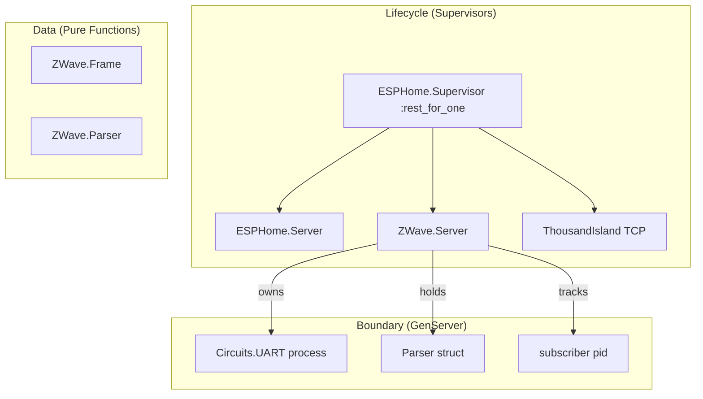
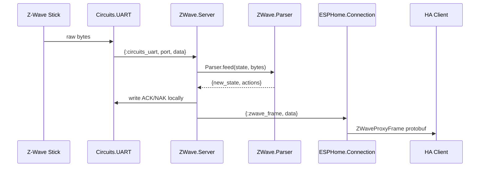

# Z-Wave Proxy Component

## Architecture

Following the Data / Boundary / Lifecycle layering:




The data flow for Z-Wave frames received from the USB stick:




## New Files

### 1. Data Layer: `lib/universal_proxy/esphome/zwave/frame.ex`

Pure functions and constants for the Z-Wave Serial API frame format. No processes, no side effects.

- Constants: `SOF` (0x01), `ACK` (0x06), `NAK` (0x15), `CAN` (0x18), `BL_MENU` (0x0D), `BL_BEGIN_UPLOAD` (0x43)
- `calculate_checksum/1` - XOR bytes from offset 1..length-2, initial value 0xFF
- `validate_checksum/1` - check a complete frame's checksum
- `build_simple_command/1` - build a `[SOF, 0x03, 0x00, cmd, checksum]` frame (used for GET_NETWORK_IDS at startup)
- `get_network_ids_command/0` - returns the pre-built GET_NETWORK_IDS (0x20) frame
- `extract_home_id/1` - given a parsed frame buffer, checks if it's a GET_NETWORK_IDS response and extracts the 4-byte home ID
- `encode_home_id/1` - convert 4 bytes to uint32 (for protobuf field)

This mirrors the pure-data approach from `Protocol` ([lib/universal_proxy/esphome/protocol.ex](lib/universal_proxy/esphome/protocol.ex)) which is all pure encode/decode functions with no process dependencies.

### 2. Data Layer: `lib/universal_proxy/esphome/zwave/parser.ex`

A pure functional state machine that mirrors the C++ `ZWaveParsingState` enum. Takes parser state + byte(s), returns new state + list of actions. Completely testable without UART or network.

**Struct:**

```elixir
defstruct [
  state: :wait_start,
  buffer: <<>>,
  buffer_index: 0,
  end_frame_after: 0,
  last_response: 0,
  in_bootloader: false
]
```

**States:** `:wait_start`, `:wait_length`, `:wait_type`, `:wait_command_id`, `:wait_payload`, `:wait_checksum`, `:send_ack`, `:send_nak`, `:send_can`, `:read_bl_menu`

**Key function:**

```elixir
@spec feed(t(), binary()) :: {t(), [action()]}
```

Where `action()` is one of:

- `{:send_response, byte}` - write ACK/NAK/CAN to UART immediately
- `{:frame_complete, binary}` - a validated frame is ready to forward to the client

The parser processes one byte at a time internally (matching the C++ `parse_byte_` / `parse_start_` / `response_handler_` split) but `feed/2` accepts a full binary and returns all accumulated actions -- this is idiomatic Elixir and lets the Server process a batch of UART bytes in one shot.

### 3. Boundary Layer: `lib/universal_proxy/esphome/zwave/server.ex`

A GenServer that manages the Z-Wave UART port and bridges between the parser and the ESPHome connection. This is the single owner of the Z-Wave serial port -- it is NOT managed through the shared `UART.Server` because Z-Wave needs protocol-level handling (local ACKs) rather than raw byte forwarding.

**State:**

```elixir
%{
  uart_pid: pid | nil,
  port_path: String.t() | nil,
  parser: Parser.t(),
  home_id: binary(),         # 4 bytes, or <<0,0,0,0>>
  home_id_ready: boolean(),
  subscriber: pid | nil,     # the one subscribed ESPHome connection
  monitor_ref: reference | nil
}
```

**Responsibilities:**

- **Init:** receives port path (or nil if no Z-Wave device yet). If a path is provided, opens `Circuits.UART` at 115200/8N1, sends `GET_NETWORK_IDS` command
- `**handle_info({:circuits_uart, _, data})`:** feeds bytes through `Parser.feed/2`, executes resulting actions:
  - `{:send_response, byte}` -> `Circuits.UART.write(uart_pid, <<byte>>)` (local ACK)
  - `{:frame_complete, frame_data}` -> check for home ID response, then forward to subscriber as `{:zwave_frame, frame_data}`
- `**subscribe(pid)`:** enforces single-subscriber (rejects if already subscribed), monitors the subscriber, returns `{:ok, home_id}` or `{:error, :already_subscribed}`
- `**unsubscribe(pid)`:** demonitors, clears subscriber
- `**send_frame(data)`:** writes to UART with duplicate single-byte response suppression (matching C++ `send_frame` logic)
- `**handle_info({:DOWN, ...})`:** auto-unsubscribe if the subscriber connection crashes
- `**home_id/0`:** returns the current home ID as a uint32
- `**available?/0`:** returns whether a Z-Wave device is connected and the port is open

**Client API (called by Connection):**

```elixir
ZWave.Server.subscribe(self())
ZWave.Server.unsubscribe(self())
ZWave.Server.send_frame(data)
ZWave.Server.home_id()
ZWave.Server.available?()
```

### 4. Public API: `lib/universal_proxy/esphome/zwave.ex`

Thin boundary module (same pattern as [lib/universal_proxy/esphome.ex](lib/universal_proxy/esphome.ex) and [lib/universal_proxy/uart.ex](lib/universal_proxy/uart.ex)) that delegates to `ZWave.Server`:

```elixir
defdelegate subscribe(pid), to: ZWave.Server
defdelegate unsubscribe(pid), to: ZWave.Server
defdelegate send_frame(data), to: ZWave.Server
defdelegate home_id(), to: ZWave.Server
defdelegate available?(), to: ZWave.Server
```

## Modified Files

### 5. Supervisor: [lib/universal_proxy/esphome/supervisor.ex](lib/universal_proxy/esphome/supervisor.ex)

Add `ZWave.Server` as a child **between** `ESPHome.Server` and `ThousandIsland`. With the existing `:rest_for_one` strategy, if ZWave.Server crashes, ThousandIsland (and all connections) restart too -- which is correct since connections may hold stale Z-Wave subscriptions.

```elixir
children = [
  Server,
  {ZWave.Server, zwave_port_path},   # <-- new
  {ThousandIsland, ...}
]
```

The Z-Wave port path comes from looking up the UART store for a device configured with `port_type: :zwave`. If no Z-Wave device is configured, pass `nil` and the server starts in idle mode.

### 6. Connection Dispatch: [lib/universal_proxy/esphome/connection.ex](lib/universal_proxy/esphome/connection.ex)

Add three new `dispatch/3` clauses before the catch-all:

`**ZWaveProxyRequest` (SUBSCRIBE):**

- Calls `ZWave.Server.subscribe(self())`
- On success, subscribes to receive `{:zwave_frame, data}` messages
- On error (already subscribed), logs warning

`**ZWaveProxyRequest` (UNSUBSCRIBE):**

- Calls `ZWave.Server.unsubscribe(self())`

`**ZWaveProxyFrame` (client -> stick):**

- Calls `ZWave.Server.send_frame(frame.data)`

Add a new `handle_info/2` clause:

`**{:zwave_frame, data}` (stick -> client):**

- Builds `%Protos.ZWaveProxyFrame{data: data}` and sends to client via `send_message/2`

`**{:zwave_home_id_changed, home_id_bytes}` (broadcast from server):**

- Builds `%Protos.ZWaveProxyRequest{type: :ZWAVE_PROXY_REQUEST_TYPE_HOME_ID_CHANGE, data: home_id_bytes}` and sends to client

### 7. DeviceConfig: [lib/universal_proxy/esphome/device_config.ex](lib/universal_proxy/esphome/device_config.ex)

In `to_device_info_response/2`, conditionally set the Z-Wave fields:

```elixir
zwave_proxy_feature_flags: if ZWave.Server.available?(), do: 1, else: 0,
zwave_home_id: ZWave.Server.home_id()
```

The feature flag value `1` corresponds to `FEATURE_ZWAVE_PROXY_ENABLED` (bit 0) from the C++ header.

### 8. ESPHome Server: [lib/universal_proxy/esphome/server.ex](lib/universal_proxy/esphome/server.ex)

In `build_serial_proxies/0`, filter out any UART device configured with `port_type: :zwave` so it does not appear in the serial proxy instance list.

### 9. UART Store: [lib/universal_proxy/esphome/uart/store.ex](lib/universal_proxy/uart/store.ex) (minor)

Add `:zwave` as a valid `port_type` in `normalize_config/1`, alongside `:ttl`, `:rs232`, `:rs485`.

## File Layout Summary

```
lib/universal_proxy/esphome/
├── zwave.ex                  # NEW - public API facade
├── zwave/
│   ├── frame.ex              # NEW - pure data: constants, checksum, frame builders
│   ├── parser.ex             # NEW - pure data: functional state machine
│   └── server.ex             # NEW - boundary: GenServer owning UART + parser
├── connection.ex             # MODIFIED - add Z-Wave dispatch clauses
├── device_config.ex          # MODIFIED - add Z-Wave fields to DeviceInfoResponse
├── server.ex                 # MODIFIED - exclude Z-Wave from serial proxies
└── supervisor.ex             # MODIFIED - add ZWave.Server to children
```

## Key Design Decisions

- **Separate UART ownership:** ZWave.Server owns its Circuits.UART process directly rather than going through the shared UART.Server. The Z-Wave protocol requires local ACK handling which is fundamentally incompatible with the raw-byte PubSub broadcast model used for serial proxies.
- **Pure parser core:** `Parser.feed/2` is a pure function returning `{new_state, actions}` -- no side effects. This makes it trivially unit-testable: feed bytes in, assert actions come out.
- **Single subscriber:** Only one ESPHome connection can be the Z-Wave subscriber at a time, matching the C++ implementation. The Z-Wave Serial API is single-master.
- **GenServer, not per-connection:** The Z-Wave port stays open across client connect/disconnect cycles. Home ID detection happens at startup regardless of whether a client is connected. This is different from serial proxy where ports are opened/closed per connection.

