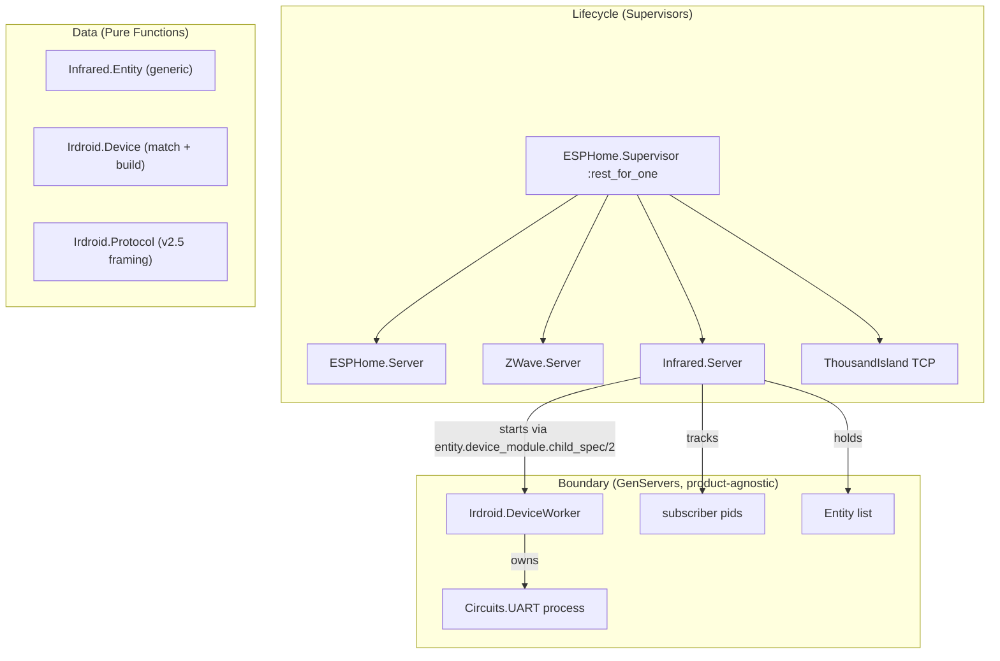
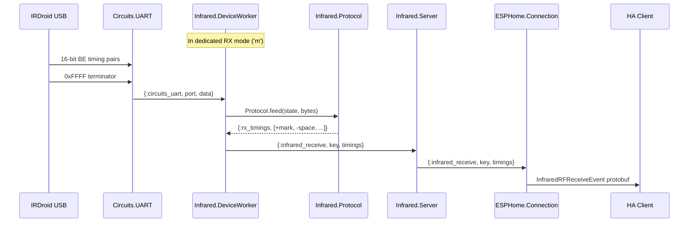
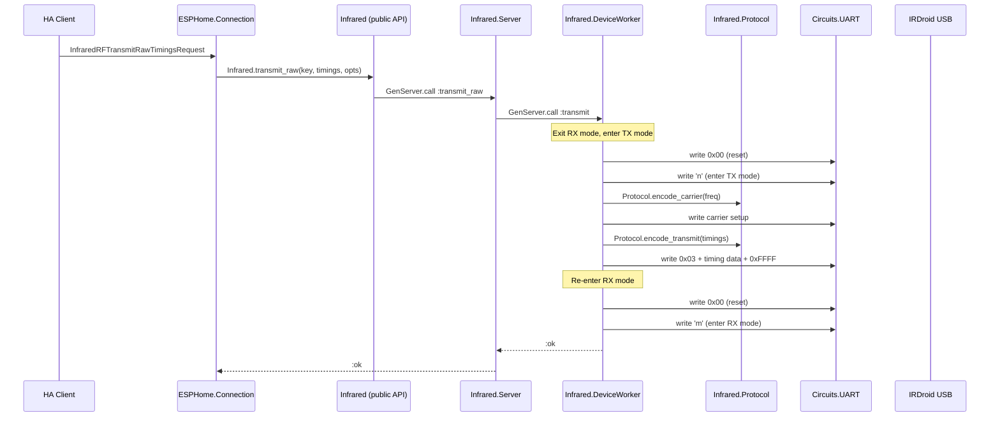

# Infrared Proxy Component

## Overview

Add an infrared proxy subsystem that exposes auto-detected IRDroid/IR Toy USB devices as infrared entities over the ESPHome Native API. Only devices that are both **configured** (`port_type: :infrared` in UART Store) and **connected** (present in `Circuits.UART.enumerate()`) are exposed.

Targets **firmware v2.5+** which added dedicated transmit (`'n'`) and receive (`'m'`) modes separated from the original combined sampling mode (`'s'`). The dedicated modes eliminate the need for handshake-based transmit, significantly simplifying the protocol. Reference: [Irdroid/USB_Infrared_Transceiver](https://github.com/Irdroid/USB_Infrared_Transceiver).

## Architecture

Following the Data / Boundary / Lifecycle layering:




The data flow for infrared signals received from an IRDroid/IR Toy device (v2.5 dedicated RX mode `'m'`):




The data flow for transmitting infrared from a client (v2.5 dedicated TX mode, no handshake):




## Device Capabilities by Product ID


| Product ID | Hex      | Transmit | Receive | Notes                                 |
| ---------- | -------- | -------- | ------- | ------------------------------------- |
| 64776      | `0xFD08` | Yes      | No      | Original IR Toy / IRDroid transmitter |
| 62859      | `0xF58B` | Yes      | Yes     | IRDroid transceiver with receiver     |


Capabilities are determined at inventory build time based on the `product_id` from `Circuits.UART.enumerate()`. Only configured + connected devices are included in the inventory.

## New Files

### 1. Data Layer: `lib/universal_proxy/esphome/infrared/entity.ex`

`UniversalProxy.ESPHome.Infrared.Entity` -- product-agnostic struct and helpers for deterministic ESPHome entity mapping. Any infrared product (IRDroid, future devices) produces these.

```elixir
defstruct [
  :key,
  :object_id,
  :name,
  :serial_number,
  :port_path,
  :product_id,
  :capabilities,
  :device_module
]
```

**Key functions:**

- `new/1` -- takes a keyword list / map with serial_number, port_path, product_id, name, capabilities, device_module; returns `%Entity{}` with:
  - `key` = `:erlang.phash2({serial_number, "infrared"}, 0xFFFFFFFF)` (stable per device)
  - `object_id` = `"infrared_#{serial_number}"`
- `to_list_entities_response/1` -- converts to `%Protos.ListEntitiesInfraredResponse{}`
- `can_receive?/1` -- returns true if capabilities include `:receive`
- `can_transmit?/1` -- returns true if capabilities include `:transmit`

The `device_module` field stores the product-specific module implementing the `Infrared.Device` behaviour (e.g. `Infrared.Irdroid.Device`). This allows the generic `Server` to start the correct worker per product family via `device_module.child_spec/2`.

### 2. Data Layer: `lib/universal_proxy/esphome/infrared/irdroid/protocol.ex`

`UniversalProxy.ESPHome.Infrared.Irdroid.Protocol` -- pure functions for IRDroid/IR Toy v2.5 dedicated-mode framing. No processes, no side effects. IRDroid-specific.

**Firmware v2.5 Modes** (from [main.c](https://github.com/Irdroid/USB_Infrared_Transceiver/blob/master/USB_Infrared_Transceiver_source/main.c)):


| Command | Mode   | Source File | Description                                                    |
| ------- | ------ | ----------- | -------------------------------------------------------------- |
| `'m'`   | `IR_R` | `IRr.c`     | Dedicated receive -- IRRXIE enabled, no TX support             |
| `'n'`   | `IR_T` | `IRt.c`     | Dedicated transmit -- IRRXIE disabled, handles `0x03` transmit |
| `'s'`   | `IR_S` | `IRs.c`     | Combined sampling mode (backward compat, not used here)        |
| `0x00`  | reset  | `main.c`    | Exit any mode, return to default                               |
| `'v'`   | --     | `main.c`    | Report version: `V` + hw_version + fw_h + fw_l (4 bytes)       |


**Struct:**

```elixir
defstruct [
  mode: :idle,
  buffer: <<>>,
  pulse: true
]
```

**Key functions:**

- `reset/0` -- returns `<<0x00>>` to exit current mode and return to main
- `enter_receive_mode/0` -- returns `"m"` to enter dedicated receive mode
- `enter_transmit_mode/0` -- returns `"n"` to enter dedicated transmit mode
- `get_version/0` -- returns `"v"` command
- `encode_transmit/2` -- takes `timings` (list of signed microsecond ints) and `opts`; converts ESPHome raw timings to IR Toy 16-bit big-endian format (`us / 21.3333` per count); returns binary: `<<0x25, 0x03>>` (enable notify-on-complete, then start TX) + timing data + `<<0xFF, 0xFF>>` terminator
- `encode_carrier/1` -- takes frequency in Hz, returns `<<0x06, pr2_value, 0x00>>` for the PWM setup command. PR2 = `round(48_000_000 / (16 * freq)) - 1`, clamped to 0..255
- `feed/2` -- takes `%Protocol{}` state and binary data, returns `{new_state, [action]}` where actions are:
  - `{:version, hw, sw}` -- parsed version response (4 bytes: `V`, hw_digit, fw_h, fw_l)
  - `{:mode_entered, version_string}` -- device acknowledged mode entry (`"S01"`)
  - `{:rx_timings, [integer()]}` -- received IR signal as list of signed microsecond timings (positive = mark, negative = space), emitted when `0xFFFF` terminator is seen
  - `{:tx_complete}` -- transmit success (device sends `'C'`)
  - `{:tx_error, :buffer_underrun}` -- transmit failure (device sends `'F'`)
  - `{:rx_overflow}` -- six `0xFF` bytes = device buffer overflow

**Timing conversion:**

- Device -> ESPHome: `round(raw_count * 21.3333)`, alternating sign (first = positive/mark)
- ESPHome -> Device: `round(abs(timing_us) / 21.3333)`, encoded as big-endian uint16

**No handshake, no chunking:** In dedicated TX mode (`'n'`), the device reads timing data directly from its USB buffer as it transmits. The host writes the full transmit payload in one go. The optional notify-on-complete (`0x25`) causes the device to send `'C'` (success) or `'F'` (error) when transmission finishes.

This mirrors the pure-data approach from `ZWave.Parser` -- a functional state machine returning `{new_state, actions}`, fully testable without UART or network.

### 3. Boundary Layer: `lib/universal_proxy/esphome/infrared/irdroid/device_worker.ex`

`UniversalProxy.ESPHome.Infrared.Irdroid.DeviceWorker` -- GenServer managing a single IRDroid/IR Toy v2.5+ device. One process per connected+configured IRDroid device. Sole owner of the device's UART session. IRDroid-specific.

**State:**

```elixir
%{
  uart_pid: pid(),
  port_path: String.t(),
  entity: Entity.t(),
  protocol: Irdroid.Protocol.t(),
  server_pid: pid(),
  current_mode: :idle | :receive | :transmit
}
```

**Responsibilities:**

- **Init:** opens `Circuits.UART` at any baud (CDC-ACM, rate irrelevant), sends reset (`0x00`) + version (`'v'`). If entity supports receive, enters dedicated receive mode (`'m'`).
- `**handle_info({:circuits_uart, _, data})`:** feeds bytes through `Protocol.feed/2`, executes actions:
  - `{:rx_timings, timings}` -> sends `{:infrared_receive, entity.key, timings}` to server
  - `{:version, hw, sw}` -> logs, validates firmware
  - `{:mode_entered, version}` -> logs mode entry
  - `{:tx_complete}` -> logs transmit success (only relevant during blocking transmit call)
  - `{:tx_error, reason}` -> logs transmit failure
  - `{:rx_overflow}` -> logs overflow, re-enters receive mode
- `**handle_call({:transmit, timings, opts}, _from, state)`:** **synchronous transmit** using dedicated TX mode:
  1. Exit current mode: write `Protocol.reset()` to UART
  2. Enter TX mode: write `Protocol.enter_transmit_mode()` to UART, wait for `"S01"` ack
  3. Set carrier: write `Protocol.encode_carrier(freq)` to UART
  4. Write full payload: `Protocol.encode_transmit(timings, opts)` — includes `0x25` (notify), `0x03` (TX start), timing data, `0xFFFF` terminator
  5. Wait for completion: `'C'` (success) or `'F'` (error) from device — short timeout
  6. Re-enter RX mode: write `Protocol.reset()` then `Protocol.enter_receive_mode()` to UART (only if entity supports receive)
  7. Reply `:ok` or `{:error, reason}` to caller
  Because this is a synchronous `handle_call`, the GenServer mailbox naturally serializes concurrent transmit requests — no deferred-reply pattern, no busy-rejection, no concurrency guards. A second caller simply waits in the GenServer call queue until the first transmit completes.
- **Crash isolation:** if this process crashes, only this one device is affected. The supervisor restarts it and it re-initializes the UART session. Any in-flight transmit caller receives an exit signal.

### 4. Data Layer: `lib/universal_proxy/esphome/infrared/irdroid/device.ex`

`UniversalProxy.ESPHome.Infrared.Irdroid.Device` -- IRDroid-specific device identification and entity factory. Encapsulates USB ID matching and per-PID capability mapping.

**Constants:**

- `@vendor_id 0x04D8` (Microchip / IRDroid)
- `@known_product_ids %{0xFD08 => [:transmit], 0xF58B => [:transmit, :receive]}`

**Key functions:**

- `match?/1` -- takes enumeration info map, returns `true` if vendor_id and product_id match a known IRDroid device
- `build_entity/3` -- takes a saved config map, port path, and enumeration info, returns an `%Entity{}` with `device_module: Irdroid.Device` and capabilities derived from the product ID

### 5. Boundary Layer: `lib/universal_proxy/esphome/infrared/server.ex`

`UniversalProxy.ESPHome.Infrared.Server` -- GenServer that coordinates infrared inventory, device workers, and ESPHome connection subscriptions. Product-agnostic -- delegates to product-specific modules for device matching and entity building.

**State:**

```elixir
%{
  entities: [Entity.t()],
  workers: %{key => pid()},
  subscribers: MapSet.t(pid())
}
```

**Responsibilities:**

- **Init:** builds inventory by joining `UART.Store.all_configs()` (where `port_type == :infrared`) with `Circuits.UART.enumerate()` (matching serial number to path + reading product_id). For each device, consults registered product modules (currently only `Irdroid.Device`) via `match?/1` to identify it and `build_entity/3` to create an entity. Only configured + connected + recognized devices produce entities. Starts the appropriate worker (via `entity.device_module.child_spec/2`) for each entity under the `Infrared.WorkerSupervisor` DynamicSupervisor.
- `**list_entities/0`:** returns the current entity list (for `ListEntitiesRequest` handler)
- `**transmit_raw/3`:** looks up worker by entity key, delegates transmit call
- `**subscribe/1`:** adds connection pid to subscribers set, monitors it. Receive events from workers are forwarded to all subscribers.
- `**unsubscribe/1`:** removes connection pid from subscribers
- `**handle_info({:infrared_receive, key, timings})`:** forwards to all subscriber pids as `{:infrared_receive, key, timings}`
- `**handle_info({:DOWN, ...})`:** auto-unsubscribe crashed connections; auto-remove crashed workers

### 6. Public API: `lib/universal_proxy/esphome/infrared.ex`

`UniversalProxy.ESPHome.Infrared` -- thin boundary module (same pattern as [lib/universal_proxy/esphome/zwave.ex](lib/universal_proxy/esphome/zwave.ex)):

```elixir
defdelegate list_entities(), to: Infrared.Server
defdelegate transmit_raw(key, timings, opts), to: Infrared.Server
defdelegate subscribe(pid), to: Infrared.Server
defdelegate unsubscribe(pid), to: Infrared.Server
```

## Modified Files

### 7. Supervisor: [lib/universal_proxy/esphome/supervisor.ex](lib/universal_proxy/esphome/supervisor.ex)

Add `Infrared.WorkerSupervisor` (DynamicSupervisor) and `Infrared.Server` as children **between** `ZWave.Server` and `ThousandIsland`. With the existing `:rest_for_one` strategy, if Infrared.Server crashes, ThousandIsland (and all connections) restart too -- correct since connections may hold stale infrared subscriptions.

```elixir
children = [
  Server,
  {ZWave.Server, zwave_port_path},
  {DynamicSupervisor, name: Infrared.WorkerSupervisor, strategy: :one_for_one},
  Infrared.Server,
  {ThousandIsland, ...}
]
```

### 8. Connection Dispatch: [lib/universal_proxy/esphome/connection.ex](lib/universal_proxy/esphome/connection.ex)

**Extend `ListEntitiesRequest` dispatch:**

Currently sends only `ListEntitiesDoneResponse`. Change to:

1. For each entity in `Infrared.list_entities()`, send a `ListEntitiesInfraredResponse` via `Entity.to_list_entities_response/1`
2. Then send `ListEntitiesDoneResponse`

**Add `InfraredRFTransmitRawTimingsRequest` dispatch clause:**

- Extract `key`, `timings`, `carrier_frequency`, `repeat_count` from request
- Call `Infrared.transmit_raw(key, timings, carrier_frequency: carrier_frequency, repeat_count: repeat_count)`
- Log result

**Add infrared subscribe/unsubscribe:**

- On connection init (or on first IR-related request), call `Infrared.subscribe(self())`
- Track `infrared_subscribed: boolean` in connection state
- On disconnect cleanup, call `Infrared.unsubscribe(self())`

**Add `handle_info({:infrared_receive, key, timings})`:**

- Build `%Protos.InfraredRFReceiveEvent{key: key, timings: timings}` and send to client

### 9. ESPHome Server: [lib/universal_proxy/esphome/server.ex](lib/universal_proxy/esphome/server.ex)

No changes needed -- infrared inventory is managed by `Infrared.Server`, not here. The existing `build_serial_proxies/0` already excludes `:infrared` port types.

### 10. Message Types: [lib/universal_proxy/esphome/message_types.ex](lib/universal_proxy/esphome/message_types.ex)

Verify that IDs 135, 136, 137 are already registered (they are). No changes expected unless new messages are added.

## File Layout Summary

```
lib/universal_proxy/esphome/
├── infrared.ex                          # NEW - public API facade (product-agnostic)
├── infrared/
│   ├── entity.ex                        # NEW - pure data: entity struct + helpers (product-agnostic)
│   ├── server.ex                        # NEW - boundary: inventory + subscribers + routing (product-agnostic)
│   └── irdroid/
│       ├── device.ex                    # NEW - pure data: USB ID matching + entity factory (IRDroid-specific)
│       ├── protocol.ex                  # NEW - pure data: v2.5 dedicated-mode framing (IRDroid-specific)
│       └── device_worker.ex             # NEW - boundary: GenServer owning one UART (IRDroid-specific)
├── connection.ex                        # MODIFIED - add IR entity listing, transmit dispatch, receive forwarding
├── supervisor.ex                        # MODIFIED - add Infrared.WorkerSupervisor + Infrared.Server to children
└── (existing files unchanged)
```

To add a new infrared product family in the future, create a new subdirectory (e.g. `infrared/other_product/`) with its own `device.ex`, `protocol.ex`, and `device_worker.ex`, then register it in `Server`'s product module list.

## Key Design Decisions

- **Firmware v2.5+ only:** We target the v2.5 firmware which separates transmit and receive into dedicated modes (`'n'` and `'m'`). This eliminates the handshake-based transmit protocol from the older combined sampling mode, dramatically simplifying the implementation. Devices on older firmware are not supported.
- **Dedicated mode switching:** The worker stays in receive mode (`'m'`) by default. For transmit, it exits to main mode (`0x00`), enters TX mode (`'n'`), sends data, then re-enters RX mode. Mode switches are fast (sub-millisecond over CDC-ACM).
- **Synchronous transmit (no handshake):** In dedicated TX mode, the device reads timing data directly from its USB buffer -- no chunked handshake. The host writes the full payload in one `Circuits.UART.write/2` call. The optional notify-on-complete (`0x25`) provides a `'C'`/`'F'` completion signal. This means `handle_call` can block synchronously, and concurrent callers are naturally serialized by the GenServer mailbox. No deferred-reply pattern, no busy-rejection, no `tx_from` tracking.
- **Separate UART ownership:** Each `DeviceWorker` owns its `Circuits.UART` process directly, not through the shared `UART.Server`. The IR Toy protocol requires stateful mode switching that is incompatible with the raw-byte PubSub broadcast model used for serial proxies. Same rationale as `ZWave.Server`.
- **Pure protocol core:** `Protocol.feed/2` is a pure function returning `{new_state, actions}` -- no side effects. Transmit encoding is also pure. This makes timing conversion and framing trivially unit-testable.
- **Configured + connected gate:** Only infrared devices that have a saved config in UART Store AND are physically present in `Circuits.UART.enumerate()` appear in the entity list and get a worker process. Unplugging a device removes it on next supervisor restart; plugging it back in (with auto-detect) restores it.
- **Product-family extensibility:** IRDroid-specific code (protocol, device worker, USB ID matching) lives under `infrared/irdroid/`. The generic infrastructure (Entity, Server, facade) is product-agnostic. Adding a new IR product family means adding a new subdirectory with its own `device.ex`, `protocol.ex`, and `device_worker.ex`, then registering it in the Server's product module list.
- **Per-PID capability detection:** Product ID `0xF58B` (62859) gets transmit + receive capabilities; `0xFD08` (64776) gets transmit only. Capability mapping lives in `Irdroid.Device`. Workers for transmit-only devices skip the receive path entirely (stay in idle mode, don't enter `'m'`) and do not forward IR timing data.
- **Multi-subscriber:** Unlike Z-Wave (single-master, one subscriber), infrared receive events are broadcast to all subscribed connections. Multiple HA instances could theoretically listen for IR events simultaneously.
- **Worker-per-device:** Each infrared device gets its own GenServer under a DynamicSupervisor. A crash or protocol error on one device does not affect others. Workers are restarted independently.
