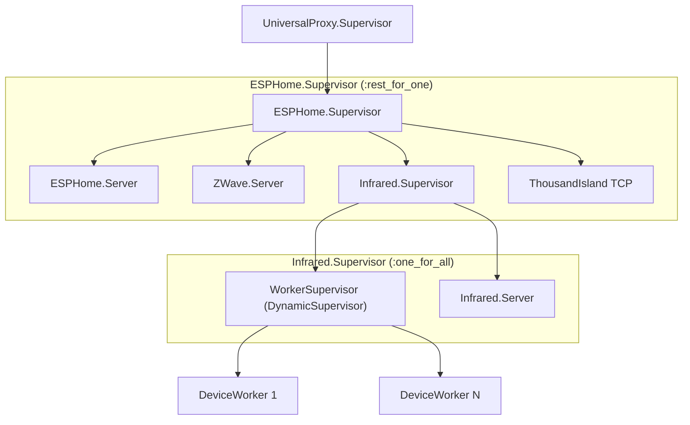
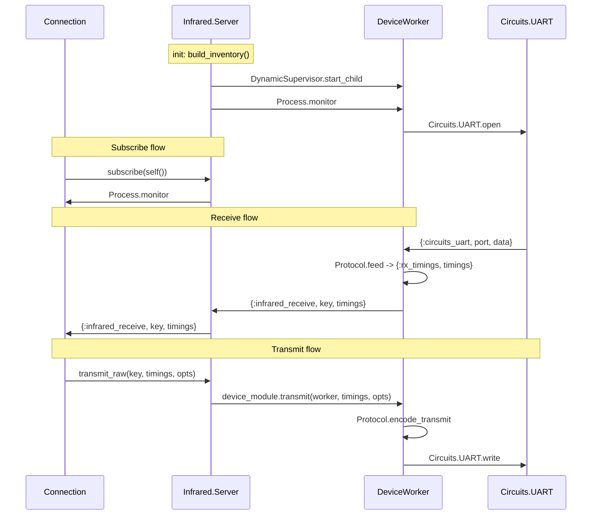
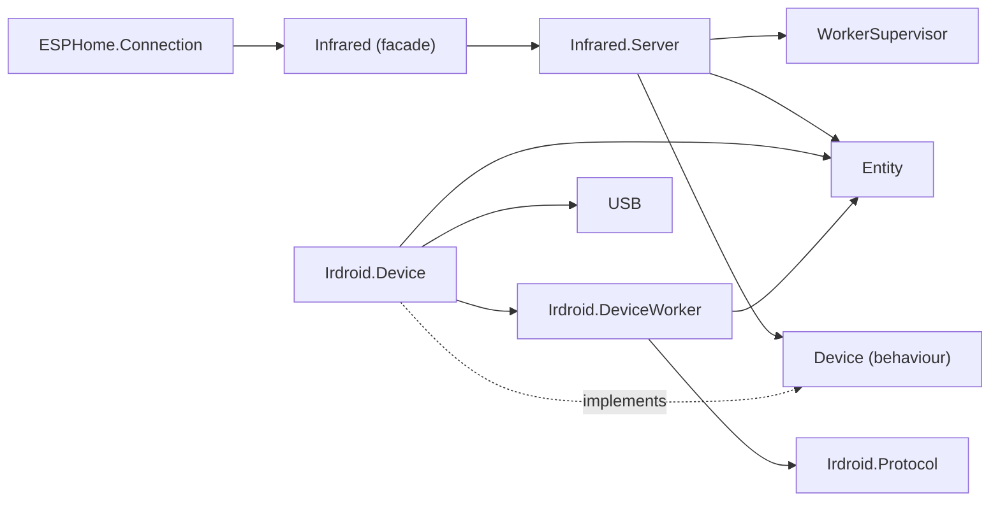

# Infrared Component Architecture

Documents the infrared subsystem after the behaviour refactor, supervision
restructuring, and idiomatic Elixir cleanup passes. Supersedes the
supervision tree section of plan 07.

## Data / Boundary / Lifecycle Layers

The infrared subsystem follows the same three-layer pattern used across the
project. Each layer has a clear responsibility and dependency direction:
data is pure, boundary owns processes, lifecycle manages restarts.

### Data (pure functions, no processes)

| Module | Role |
|--------|------|
| `Infrared.Entity` | Struct describing an IR device: key, name, serial, capabilities, device_module. Converts to protobuf messages. |
| `Infrared.Device` | Behaviour defining the product-module contract: `match?/1`, `build_entity/3`, `child_spec/2`, `transmit/3`. |
| `Irdroid.Protocol` | Pure state machine for IRDroid v2.5 framing. Encodes TX commands, parses RX frames, converts between device timer counts (~21.33 us/count) and ESPHome microsecond timings. |
| `USB` | Shared USB VID/PID parser. Handles integer, hex-string, decimal-string, and nil inputs. |

### Boundary (GenServers, I/O owners)

| Module | Role |
|--------|------|
| `Infrared.Server` | Inventory manager. Joins UART Store configs with `Circuits.UART.enumerate()`, identifies devices via product modules, starts workers, tracks subscribers, routes transmit/receive. |
| `Irdroid.DeviceWorker` | Per-device UART owner. Runs the Protocol state machine, handles mode switching (idle/receive/transmit), forwards `{:infrared_receive, key, timings}` to the server. |
| `Infrared` | Public API facade. Delegates to `Infrared.Server`. |

### Lifecycle (supervisors)

| Module | Strategy | Children |
|--------|----------|----------|
| `ESPHome.Supervisor` | `:rest_for_one` | Server, ZWave.Server, **Infrared.Supervisor**, ThousandIsland |
| `Infrared.Supervisor` | `:one_for_all` | WorkerSupervisor, Infrared.Server |
| `Infrared.WorkerSupervisor` | `:one_for_one` (DynamicSupervisor) | DeviceWorker instances (`restart: :temporary`) |

## Supervision Tree

### Why `:one_for_all`?

If `Infrared.Server` crashes:

- It loses its in-memory entity list, worker PID map, and subscriber set.
- Old workers under `WorkerSupervisor` would still hold UART ports open.
- The restarted server would call `build_inventory` -> `start_worker` and get
  `{:error, {:already_started, pid}}` for every device.

With `:one_for_all`, both the server and all workers restart together. The
server rebuilds its inventory from scratch with a clean `WorkerSupervisor`.

### Why `restart: :temporary` on workers?

Workers are set to `:temporary` so the `DynamicSupervisor` does not
auto-restart them. Instead, `Infrared.Server` handles `:DOWN` messages from
monitored workers and manually restarts them via `start_worker/1`. This keeps
the server as the single source of truth for the worker PID map and avoids
races between supervisor-initiated and server-initiated restarts.

## Process Relationships

## Device Behaviour Contract

Product modules implement `Infrared.Device`:

| Callback | Purpose |
|----------|---------|
| `match?(info)` | Return true if USB enumeration info belongs to this product family. |
| `build_entity(config, path, info)` | Construct an `Entity` from UART Store config and enumeration data. |
| `child_spec(entity, server_pid)` | Return a child spec for the worker process. Worker must send `{:infrared_receive, key, timings}` to `server_pid`. |
| `transmit(worker, timings, opts)` | Send ESPHome-native signed microsecond timings through the worker. Implementation handles all device-specific translation. |

Currently one implementation: `Irdroid.Device`.

## Inventory Build

On init, `Infrared.Server` builds its inventory:

1. Read all UART Store configs where `port_type == :infrared`.
2. Cross-reference with `Circuits.UART.enumerate()` by serial number.
3. For each matched device, find a product module where `mod.match?(info)`.
4. Call `mod.build_entity(config, path, info)` to create the entity.
5. Call `start_worker(entity)` which uses `entity.device_module.child_spec/2`
   to start a worker under the `DynamicSupervisor` and monitor it.

If inventory build fails entirely (e.g. UART enumeration error), the server
starts with empty entities/workers and logs the full stacktrace.

## Worker Lifecycle

| Event | Action |
|-------|--------|
| Worker started | Server stores `{key => {device_module, pid}}`, monitors pid |
| Worker crashes | Server receives `:DOWN`, looks up entity by key, calls `start_worker/1` to restart, updates PID map |
| Restart fails | Server logs error, removes key from workers map |
| Server crashes | `:one_for_all` restarts both server and WorkerSupervisor; server rebuilds from scratch |

## Module Dependency Graph

Solid arrows are runtime calls. Dashed arrows are behaviour implementations.
